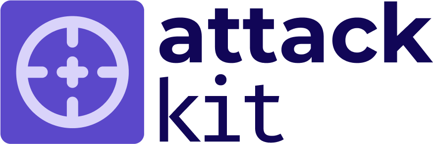

# Steadybit ActionKit

The Steadybit ActionKit enables the extension of Steadybit with new action capabilities that you can use within experiments. For example, ActionKit can be used to author open/closed source:

- attacks to attack AWS, Azure, and Google Cloud services that Steadybit cannot natively attack,
- integrate load testing tools,
- health and state checks and
- every other runnable action!

At this moment, ActionKit can be considered an **open-beta**. The contracts and APIs *may* change. If you want to learn more, [reach out to us](https://www.steadybit.com/contact).

## Getting Started

We recommend that you read the following documentation to get started with ActionKit.

 - [Action API](/docs/action-api.md)
 - [Action Registration](/docs/action-registration.md)
 - [Terminology](/docs/terminology.md)
 - [Examples](/docs/examples.md)
 - [FAQ](/docs/faq.md)
