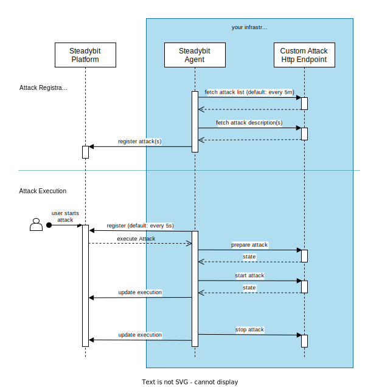

# Steadybit Attack Kit

This repository represents a **work-in-progress** documentation and implementation of Steadybit's attack mechanism. If you are curious to learn
more, [reach out to us](https://www.steadybit.com/contact).

## Overview



## Registering and Discovering Attacks

New attacks are discovered from attack index(es) queried by HTTP. These indexes must be declared to the agents using environment variables:

```shell
# Attack index to query
STEADYBIT_AGENT_ATTACKS_EXTENSIONS_0_URL=http://custom-attacks-A

STEADYBIT_AGENT_ATTACKS_EXTENSIONS_1_URL=http://custom-attacks-B
STEADYBIT_AGENT_ATTACKS_EXTENSIONS_1_METHOD=GET #Http verb used to query the index (default: GET)
STEADYBIT_AGENT_ATTACKS_EXTENSIONS_1_BASIC_USERNAME=<user> #Username used for Basic Authentication  
STEADYBIT_AGENT_ATTACKS_EXTENSIONS_1_BASIC_PASSWORD=<password> #Password used for Basic Authentication
```

[Example Index Response](./typescript-api/api.d.ts#L11):

```json
{
  "attacks": [
    {
      "path": "/attacks/logging"
    }
  ]
}
```

Please note that teams configured in Steadybit need to be granted access to new attacks. You can grant access to attacks via Steadybit's team settings views.

## Attack Description

Each path from the index response is queried to describe each attack. Beside `name` and `description`, this defines which targets can be attacked and what
parameters can be configured by the user. The `prepare`, `start` and `stop` properties specify the endpoint to be called for each action.

#### `icon`

An icon that is used to identify your attack in the ui. Needs to be a data-uri containing an image. You can use a online generator for that, for
example https://dopiaza.org/tools/datauri. For best compatibility we suggest to use svg with `fill="currentColor"`. The max length for the data-uri is
1,000,000.

#### `version`

The version of the attack. Remember to increase the value everytime you update the definitions. The platform will ignore any definition changes with the same
attack version.

#### `timeControl`

There are 3 options:

1. One-Shots (e.g. killing processes) - `"timeControl": "ONE_SHOT"`
2. Start, wait a certain time and then stop (e.g. network blackhole) - `"timeControl": "BY_AGENT"` - steadybit agent controls timing, the attack needs a
   parameter `duration` of type `duration`.
3. Start and wait for finish (e.g. service rollover) - not yet supported - waits for the external action to finish.

[Example Describe Attack Response](./typescript-api/api.d.ts#L15):

```json
{
  "id": "logging-attack",
  "name": "Logging Attack",
  "icon": "data:image/svg+xml;base64,PD94bWwgdmVyc2lvbj0iMS4wIiBlbmNvZGluZz0idXRmLTgiPz4NCjwhLS0gR2VuZXJhdG9yOiBBZG9iZSBJbGx1c3RyYXRvciAxNi4wLjQsIFNWRyBFeHBvcnQgUGx1Zy1JbiAuIFNWRyBWZXJzaW9uOiA2LjAwIEJ1aWxkIDApICAtLT4NCjwhRE9DVFlQRSBzdmcgUFVCTElDICItLy9XM0MvL0RURCBTVkcgMS4xLy9FTiIgImh0dHA6Ly93d3cudzMub3JnL0dyYXBoaWNzL1NWRy8xLjEvRFREL3N2ZzExLmR0ZCI+DQo8c3ZnIHZlcnNpb249IjEuMSIgaWQ9IkxheWVyXzEiIHhtbG5zPSJodHRwOi8vd3d3LnczLm9yZy8yMDAwL3N2ZyIgeG1sbnM6eGxpbms9Imh0dHA6Ly93d3cudzMub3JnLzE5OTkveGxpbmsiIHg9IjBweCIgeT0iMHB4Ig0KCSB3aWR0aD0iNjEycHgiIGhlaWdodD0iNTAyLjE3NHB4IiB2aWV3Qm94PSIwIDY1LjMyNiA2MTIgNTAyLjE3NCIgZW5hYmxlLWJhY2tncm91bmQ9Im5ldyAwIDY1LjMyNiA2MTIgNTAyLjE3NCINCgkgeG1sOnNwYWNlPSJwcmVzZXJ2ZSI+DQo8ZWxsaXBzZSBmaWxsPSIjQzZDNkM2IiBjeD0iMjgzLjUiIGN5PSI0ODcuNSIgcng9IjI1OSIgcnk9IjgwIi8+DQo8cGF0aCBpZD0iYmlyZCIgZD0iTTIxMC4zMzMsNjUuMzMxQzEwNC4zNjcsNjYuMTA1LTEyLjM0OSwxNTAuNjM3LDEuMDU2LDI3Ni40NDljNC4zMDMsNDAuMzkzLDE4LjUzMyw2My43MDQsNTIuMTcxLDc5LjAzDQoJYzM2LjMwNywxNi41NDQsNTcuMDIyLDU0LjU1Niw1MC40MDYsMTEyLjk1NGMtOS45MzUsNC44OC0xNy40MDUsMTEuMDMxLTE5LjEzMiwyMC4wMTVjNy41MzEtMC4xNywxNC45NDMtMC4zMTIsMjIuNTksNC4zNDENCgljMjAuMzMzLDEyLjM3NSwzMS4yOTYsMjcuMzYzLDQyLjk3OSw1MS43MmMxLjcxNCwzLjU3Miw4LjE5MiwyLjg0OSw4LjMxMi0zLjA3OGMwLjE3LTguNDY3LTEuODU2LTE3LjQ1NC01LjIyNi0yNi45MzMNCgljLTIuOTU1LTguMzEzLDMuMDU5LTcuOTg1LDYuOTE3LTYuMTA2YzYuMzk5LDMuMTE1LDE2LjMzNCw5LjQzLDMwLjM5LDEzLjA5OGM1LjM5MiwxLjQwNyw1Ljk5NS0zLjg3Nyw1LjIyNC02Ljk5MQ0KCWMtMS44NjQtNy41MjItMTEuMDA5LTEwLjg2Mi0yNC41MTktMTkuMjI5Yy00LjgyLTIuOTg0LTAuOTI3LTkuNzM2LDUuMTY4LTguMzUxbDIwLjIzNCwyLjQxNWMzLjM1OSwwLjc2Myw0LjU1NS02LjExNCwwLjg4Mi03Ljg3NQ0KCWMtMTQuMTk4LTYuODA0LTI4Ljg5Ny0xMC4wOTgtNTMuODY0LTcuNzk5Yy0xMS42MTctMjkuMjY1LTI5LjgxMS02MS42MTctMTUuNjc0LTgxLjY4MWMxMi42MzktMTcuOTM4LDMxLjIxNi0yMC43NCwzOS4xNDcsNDMuNDg5DQoJYy01LjAwMiwzLjEwNy0xMS4yMTUsNS4wMzEtMTEuMzMyLDEzLjAyNGM3LjIwMS0yLjg0NSwxMS4yMDctMS4zOTksMTQuNzkxLDBjMTcuOTEyLDYuOTk4LDM1LjQ2MiwyMS44MjYsNTIuOTgyLDM3LjMwOQ0KCWMzLjczOSwzLjMwMyw4LjQxMy0xLjcxOCw2Ljk5MS02LjAzNGMtMi4xMzgtNi40OTQtOC4wNTMtMTAuNjU5LTE0Ljc5MS0yMC4wMTZjLTMuMjM5LTQuNDk1LDUuMDMtNy4wNDUsMTAuODg2LTYuODc2DQoJYzEzLjg0OSwwLjM5NiwyMi44ODYsOC4yNjgsMzUuMTc3LDExLjIxOGM0LjQ4MywxLjA3Niw5Ljc0MS0xLjk2NCw2LjkxNy02LjkxN2MtMy40NzItNi4wODUtMTMuMDE1LTkuMTI0LTE5LjE4LTEzLjQxMw0KCWMtNC4zNTctMy4wMjktMy4wMjUtNy4xMzIsMi42OTctNi42MDJjMy45MDUsMC4zNjEsOC40NzgsMi4yNzEsMTMuOTA4LDEuNzY3YzkuOTQ2LTAuOTI1LDcuNzE3LTcuMTY5LTAuODgzLTkuNTY2DQoJYy0xOS4wMzYtNS4zMDQtMzkuODkxLTYuMzExLTYxLjY2NS01LjIyNWMtNDMuODM3LTguMzU4LTMxLjU1NC04NC44ODcsMC05MC4zNjNjMjkuNTcxLTUuMTMyLDYyLjk2Ni0xMy4zMzksOTkuOTI4LTMyLjE1Ng0KCWMzMi42NjgtNS40MjksNjQuODM1LTEyLjQ0Niw5Mi45MzktMzMuODVjNDguMTA2LTE0LjQ2OSwxMTEuOTAzLDE2LjExMywyMDQuMjQxLDE0OS42OTVjMy45MjYsNS42ODEsMTUuODE5LDkuOTQsOS41MjQtNi4zNTENCgljLTE1Ljg5My00MS4xMjUtNjguMTc2LTkzLjMyOC05Mi4xMy0xMzIuMDg1Yy0yNC41ODEtMzkuNzc0LTE0LjM0LTYxLjI0My0zOS45NTctOTEuMjQ3DQoJYy0yMS4zMjYtMjQuOTc4LTQ3LjUwMi0yNS44MDMtNzcuMzM5LTE3LjM2NWMtMjMuNDYxLDYuNjM0LTM5LjIzNC03LjExNy01Mi45OC0zMS4yNzNDMzE4LjQyLDg3LjUyNSwyNjUuODM4LDY0LjkyNywyMTAuMzMzLDY1LjMzMQ0KCXogTTQ0NS43MzEsMjAzLjAxYzYuMTIsMCwxMS4xMTIsNC45MTksMTEuMTEyLDExLjAzOGMwLDYuMTE5LTQuOTk0LDExLjExMS0xMS4xMTIsMTEuMTExcy0xMS4wMzgtNC45OTQtMTEuMDM4LTExLjExMQ0KCUM0MzQuNjkzLDIwNy45MjksNDM5LjYxMywyMDMuMDEsNDQ1LjczMSwyMDMuMDF6Ii8+DQo8L3N2Zz4NCg==",
  "description": "Prints the received payload to the console to illustrate the attack API.",
  "version": "1.0.0",
  "category": "resource",
  "target": "container",
  "timeControl": "ONE_SHOT",
  "parameters": [
    {
      "name": "text",
      "label": "Text",
      "type": "string",
      "required": true
    }
  ],
  "prepare": {
    "path": "/attacks/logging/prepare"
  },
  "start": {
    "path": "/attacks/logging/start"
  },
  "stop": {
    "path": "/attacks/logging/stop"
  }
}
```

### Attack Execution

The Attack execution is divided into three steps: `prepare`, `start` and `stop`:

1) The `prepare` step is called with configuration and target to attack and must return `200 OK` and a json body with a state object which is then passed
   the `start` and `stop` steps.
2) The `start` step is called with the state returned by the `prepare` step. Must return `200 OK` on success or `500 Server Error` on failure. May also return a
   json body with a state object which is then passed the `stop` step.
3) The `stop` step is called with the state returned by the `prepare`/`start` step. Must return `200 OK` on success or `500 Server Error`on failure.

> **Note**: The `stop` request will also be issued if the `start` request fails. In case of timeout for `start` we can't tell if the attack was started or not,
> therefore a `stop` request is issued. So the state should contain all data to start and stop the request.

> **TBD**: How to transport logs and/or error messages

#### Prepare

[Example Prepare Request](./typescript-api/api.d.ts#L66):

```json
{
  "target": {
    "name": "docker://750d1998547f24f0ffab7f768f471ce4f25cf8c0528eedeec79338fdf88e29fb",
    "attributes": {
      "container.engine": [
        "docker"
      ],
      "container.port": [
        "5432:5432"
      ],
      "container.name": [
        "postgres_cm"
      ],
      "label.org.testcontainers.sessionid": [
        "9c250ffd-f197-4f24-ae60-7d7e4893677e"
      ],
      "label": [
        "org.testcontainers"
      ],
      "container.image": [
        "postgres:13"
      ],
      "container.ipv4": [
        "172.17.0.4"
      ],
      "agent.hostname": [
        "joshiste-mbp"
      ],
      "container.host": [
        "docker-desktop"
      ],
      "container.id": [
        "docker://750d1998547f24f0ffab7f768f471ce4f25cf8c0528eedeec79338fdf88e29fb"
      ]
    }
  },
  "config": {
    "text": "test",
    "level": "info"
  }
}

```

[Example Prepare Response](./typescript-api/api.d.ts#L74):

```json
{
  "state": {
    "text": "test",
    "level": "info"
  }
}
```

#### Start

[Example Start Request](./typescript-api/api.d.ts#L78):

```json
{
  "state": {
    "text": "test",
    "level": "info"
  }
}
```

[Example Start Response](./typescript-api/api.d.ts#L82):

```json
{
  "state": {
    "text": "test",
    "level": "info"
  }
}
```

#### Stop

[Example Stop Request](./typescript-api/api.d.ts#L86):

```json
{
  "state": {
    "text": "test",
    "level": "info"
  }
}
```

## Example

If you want to get started, we suggest to start with the [logging attack](https://github.com/steadybit/custom-attacks/tree/main/examples/nodejs-logging-attack)
example.
