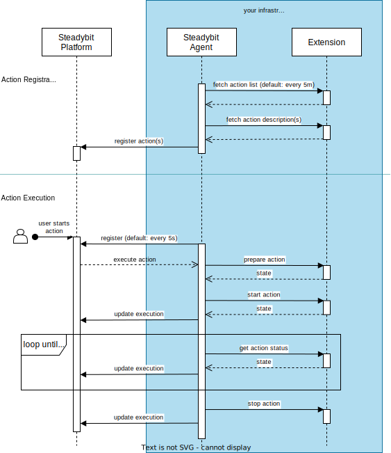

# Action API

This document explains the action API, control flow and the contracts behind it. It starts with a high-level overview and then explains every API in detail.

## Overview

Actions are implemented with the help of ActionKit and the action API through an implementation of an extension. Extensions are HTTP servers
implementing the action API to describe which actions are supported and how to execute these. The following diagram illustrates who is issuing calls and in what
phases.



As can be seen above, the extension is called by the Steadybit agent in two phases:

- In the action registration phase, Steadybit learns about the supported actions. Once this phase is completed, actions will be usable within Steadybit, e.g.,
  within the experiment editor.
- The action execution phase occurs whenever an action is executed, e.g., as part of an experiment.

The following sections explain the various API endpoints, their responsibilities and structures in more detail.

## Action List

As the name implies, the action list returns a list of supported actions. Or, more specifically, HTTP endpoints that the agent should call to learn more about
the actions.

This endpoint needs to be [registered with Steadybit agents](./action-registration.md).

### Example

```json
// Request: GET /actions

// Response: 200
{
  "actions": [
    {
      "method": "GET",
      "path": "/actions/rollout-restart"
    }
  ]
}
```

### References

- [Go API](https://github.com/steadybit/action-kit/tree/main/go/action_kit_api): `ActionListResponse`
- [TypeScript API](https://github.com/steadybit/action-kit/tree/main/typescript/action_kit_api): `ActionListResponse`
- [OpenAPI Schema](https://github.com/steadybit/action-kit/tree/main/openapi): `ActionListResponse`

## Action Description

An action description is required for each action. The HTTP endpoint serving the description is discovered through the action list endpoint.

Action descriptions expose information about the presentation, configuration and behavior of actions. For example:

- What should the action be called?
- Which configuration options should be presented to end-users within the user interface?
- Can the action be stopped, or is this an instantaneous event, e.g., host reboots?

Action description is a somewhat evolved topic. For more information on action parameters, please refer to our [parameter types](./parameter-types.md) documentation.

### Example

```json
// Request: GET /actions/rollout-restart

// Response: 200
{
  "id": "com.steadybit.example.actions.kubernetes.rollout-restart",
  "label": "Kubernetes Rollout Restart Deployment",
  "description": "Execute a rollout restart for a Kubernetes deployment",
  "version": "1.0.0",
  "icon": "data:image/svg+xml;base64,PD94bWwgdmVyc2lvbj0iMS4wIiBlbmNvZGluZz0idXRmLTgiPz4NCjwhLS0gR2VuZXJhdG9yOiBBZG9iZSBJbGx1c3RyYXRvciAxNi4wLjQsIFNWRyBFeHBvcnQgUGx1Zy1JbiAuIFNWRyBWZXJzaW9uOiA2LjAwIEJ1aWxkIDApICAtLT4NCjwhRE9DVFlQRSBzdmcgUFVCTElDICItLy9XM0MvL0RURCBTVkcgMS4xLy9FTiIgImh0dHA6Ly93d3cudzMub3JnL0dyYXBoaWNzL1NWRy8xLjEvRFREL3N2ZzExLmR0ZCI+DQo8c3ZnIHZlcnNpb249IjEuMSIgaWQ9IkxheWVyXzEiIHhtbG5zPSJodHRwOi8vd3d3LnczLm9yZy8yMDAwL3N2ZyIgeG1sbnM6eGxpbms9Imh0dHA6Ly93d3cudzMub3JnLzE5OTkveGxpbmsiIHg9IjBweCIgeT0iMHB4Ig0KCSB3aWR0aD0iNjEycHgiIGhlaWdodD0iNTAyLjE3NHB4IiB2aWV3Qm94PSIwIDY1LjMyNiA2MTIgNTAyLjE3NCIgZW5hYmxlLWJhY2tncm91bmQ9Im5ldyAwIDY1LjMyNiA2MTIgNTAyLjE3NCINCgkgeG1sOnNwYWNlPSJwcmVzZXJ2ZSI+DQo8ZWxsaXBzZSBmaWxsPSIjQzZDNkM2IiBjeD0iMjgzLjUiIGN5PSI0ODcuNSIgcng9IjI1OSIgcnk9IjgwIi8+DQo8cGF0aCBpZD0iYmlyZCIgZD0iTTIxMC4zMzMsNjUuMzMxQzEwNC4zNjcsNjYuMTA1LTEyLjM0OSwxNTAuNjM3LDEuMDU2LDI3Ni40NDljNC4zMDMsNDAuMzkzLDE4LjUzMyw2My43MDQsNTIuMTcxLDc5LjAzDQoJYzM2LjMwNywxNi41NDQsNTcuMDIyLDU0LjU1Niw1MC40MDYsMTEyLjk1NGMtOS45MzUsNC44OC0xNy40MDUsMTEuMDMxLTE5LjEzMiwyMC4wMTVjNy41MzEtMC4xNywxNC45NDMtMC4zMTIsMjIuNTksNC4zNDENCgljMjAuMzMzLDEyLjM3NSwzMS4yOTYsMjcuMzYzLDQyLjk3OSw1MS43MmMxLjcxNCwzLjU3Miw4LjE5MiwyLjg0OSw4LjMxMi0zLjA3OGMwLjE3LTguNDY3LTEuODU2LTE3LjQ1NC01LjIyNi0yNi45MzMNCgljLTIuOTU1LTguMzEzLDMuMDU5LTcuOTg1LDYuOTE3LTYuMTA2YzYuMzk5LDMuMTE1LDE2LjMzNCw5LjQzLDMwLjM5LDEzLjA5OGM1LjM5MiwxLjQwNyw1Ljk5NS0zLjg3Nyw1LjIyNC02Ljk5MQ0KCWMtMS44NjQtNy41MjItMTEuMDA5LTEwLjg2Mi0yNC41MTktMTkuMjI5Yy00LjgyLTIuOTg0LTAuOTI3LTkuNzM2LDUuMTY4LTguMzUxbDIwLjIzNCwyLjQxNWMzLjM1OSwwLjc2Myw0LjU1NS02LjExNCwwLjg4Mi03Ljg3NQ0KCWMtMTQuMTk4LTYuODA0LTI4Ljg5Ny0xMC4wOTgtNTMuODY0LTcuNzk5Yy0xMS42MTctMjkuMjY1LTI5LjgxMS02MS42MTctMTUuNjc0LTgxLjY4MWMxMi42MzktMTcuOTM4LDMxLjIxNi0yMC43NCwzOS4xNDcsNDMuNDg5DQoJYy01LjAwMiwzLjEwNy0xMS4yMTUsNS4wMzEtMTEuMzMyLDEzLjAyNGM3LjIwMS0yLjg0NSwxMS4yMDctMS4zOTksMTQuNzkxLDBjMTcuOTEyLDYuOTk4LDM1LjQ2MiwyMS44MjYsNTIuOTgyLDM3LjMwOQ0KCWMzLjczOSwzLjMwMyw4LjQxMy0xLjcxOCw2Ljk5MS02LjAzNGMtMi4xMzgtNi40OTQtOC4wNTMtMTAuNjU5LTE0Ljc5MS0yMC4wMTZjLTMuMjM5LTQuNDk1LDUuMDMtNy4wNDUsMTAuODg2LTYuODc2DQoJYzEzLjg0OSwwLjM5NiwyMi44ODYsOC4yNjgsMzUuMTc3LDExLjIxOGM0LjQ4MywxLjA3Niw5Ljc0MS0xLjk2NCw2LjkxNy02LjkxN2MtMy40NzItNi4wODUtMTMuMDE1LTkuMTI0LTE5LjE4LTEzLjQxMw0KCWMtNC4zNTctMy4wMjktMy4wMjUtNy4xMzIsMi42OTctNi42MDJjMy45MDUsMC4zNjEsOC40NzgsMi4yNzEsMTMuOTA4LDEuNzY3YzkuOTQ2LTAuOTI1LDcuNzE3LTcuMTY5LTAuODgzLTkuNTY2DQoJYy0xOS4wMzYtNS4zMDQtMzkuODkxLTYuMzExLTYxLjY2NS01LjIyNWMtNDMuODM3LTguMzU4LTMxLjU1NC04NC44ODcsMC05MC4zNjNjMjkuNTcxLTUuMTMyLDYyLjk2Ni0xMy4zMzksOTkuOTI4LTMyLjE1Ng0KCWMzMi42NjgtNS40MjksNjQuODM1LTEyLjQ0Niw5Mi45MzktMzMuODVjNDguMTA2LTE0LjQ2OSwxMTEuOTAzLDE2LjExMywyMDQuMjQxLDE0OS42OTVjMy45MjYsNS42ODEsMTUuODE5LDkuOTQsOS41MjQtNi4zNTENCgljLTE1Ljg5My00MS4xMjUtNjguMTc2LTkzLjMyOC05Mi4xMy0xMzIuMDg1Yy0yNC41ODEtMzkuNzc0LTE0LjM0LTYxLjI0My0zOS45NTctOTEuMjQ3DQoJYy0yMS4zMjYtMjQuOTc4LTQ3LjUwMi0yNS44MDMtNzcuMzM5LTE3LjM2NWMtMjMuNDYxLDYuNjM0LTM5LjIzNC03LjExNy01Mi45OC0zMS4yNzNDMzE4LjQyLDg3LjUyNSwyNjUuODM4LDY0LjkyNywyMTAuMzMzLDY1LjMzMQ0KCXogTTQ0NS43MzEsMjAzLjAxYzYuMTIsMCwxMS4xMTIsNC45MTksMTEuMTEyLDExLjAzOGMwLDYuMTE5LTQuOTk0LDExLjExMS0xMS4xMTIsMTEuMTExcy0xMS4wMzgtNC45OTQtMTEuMDM4LTExLjExMQ0KCUM0MzQuNjkzLDIwNy45MjksNDM5LjYxMywyMDMuMDEsNDQ1LjczMSwyMDMuMDF6Ii8+DQo8L3N2Zz4NCg==",
  "category": "resource",
  "target": "kubernetes-deployment",
  "timeControl": "INTERNAL",
  "parameters": [
    {
      "label": "Wait for rollout completion?",
      "name": "wait",
      "type": "boolean",
      "description": "",
      "required": false,
      "advanced": true,
      "order": 0,
      "defaultValue": "false"
    }
  ],
  "prepare": {
    "method": "POST",
    "path": "/actions/rollout-restart/prepare"
  },
  "start": {
    "method": "POST",
    "path": "/actions/rollout-restart/start"
  },
  "status": {
    "method": "POST",
    "path": "/actions/rollout-restart/status"
  },
  "stop": {
    "method": "POST",
    "path": "/actions/rollout-restart/stop"
  }
}
```

### References

- [Go API](https://github.com/steadybit/action-kit/tree/main/go/action_kit_api): `DescribeActionResponse`
- [TypeScript API](https://github.com/steadybit/action-kit/tree/main/typescript/action_kit_api): `DescribeActionResponse`
- [OpenAPI Schema](https://github.com/steadybit/action-kit/tree/main/openapi): `DescribeActionResponse`

### Versioning

Actions are versioned strictly, and Steadybit will ignore definition changes for the same version. Remember to update the version every time you update the
action description.

### Time Control

Time control informs Steadybit about behavioral aspects of the action. At this moment, there are three options:

- Instantaneous that cannot be undone, e.g., killing processes or shutting down servers: `"timeControl": "INSTANTANEOUS"`
- Actions spanning a configurable amount of time that are stoppable, e.g., causing CPU/memory stress, network configuration changes: `"timeControl": "EXTERNAL"`
  . Note that these actions require a parameter named `duration` with type `duration`.
- Actions spanning an unknown amount of time, e.g., waiting for a service to roll over or for deployment to finish: `"timeControl": "INTERNAL"`

## Action Execution

Action execution is divided into three steps:

- preparation
- start
- status
- stop

HTTP endpoints represent each step. Steadybit learns about these endpoints through the action description documented in the previous sections. The following
sub-sections explain the responsibilities of each of the endpoints in detail.

### Preparation

The preparation (or short `prepare`) step receives the action's configuration options (representing the parameters defined in the action description) and a
selected target. The HTTP endpoint must respond with an HTTP status code `200` and a JSON response body containing a state object.

The state object is later used in HTTP requests to the start and stop endpoints. So you will want to include all the execution relevant information within the
state object, e.g., a subset of the target's attributes, the configuration options and the original state (in case you are going to do some system modification
as part of the start step).

#### Example

```json
// Request: POST /actions/rollout-restart/prepare
{
  "config": {
    "wait": true
  },
  "target": {
    "name": "demo-dev/steadybit-demo/gateway",
    "attributes": {
      "k8s.deployment": [
        "gateway"
      ],
      "k8s.namespace": [
        "steadybit-demo"
      ],
      "k8s.cluster-name": [
        "demo-dev"
      ]
    }
  }
}

// Response: 200
{
  "state": {
    "Cluster": "demo-dev",
    "Namespace": "steadybit-demo",
    "Deployment": "gateway",
    "Wait": true
  }
}
```

#### References

- [Go API](https://github.com/steadybit/action-kit/tree/main/go/action_kit_api): `PrepareActionRequestBody`, `PrepareActionResponse`
- [TypeScript API](https://github.com/steadybit/action-kit/tree/main/typescript/action_kit_api): `PrepareActionRequestBody`, `PrepareActionResponse`
- [OpenAPI Schema](https://github.com/steadybit/action-kit/tree/main/openapi): `PrepareActionRequestBody`, `PrepareActionResponse`

### Start

The actual action happens within the start step, i.e., this is where you will typically modify the system, kill processes or reboot servers.

The start step receives the prepare step's state object. The HTTP endpoint must respond with an HTTP status code `200` on success or `500` on failure. A JSON
response body containing a state object may be returned. This state object is later passed to the stop step.

This endpoint must respond within a few seconds. It is not permitted to block until the action execution is completed within the start endpoint. For example,
you can trigger a deployment change within the start endpoint, but the start endpoint may not block until the deployment change is fully rolled out (this is
what the status endpoint is for).

#### Example

```json
// Request: POST /actions/rollout-restart/start
{
  "state": {
    "Cluster": "demo-dev",
    "Namespace": "steadybit-demo",
    "Deployment": "gateway",
    "Wait": true
  }
}

// Response: 200
{
  "state": {
    "Cluster": "demo-dev",
    "Namespace": "steadybit-demo",
    "Deployment": "gateway",
    "Wait": true
  }
}
```

#### References

- [Go API](https://github.com/steadybit/action-kit/tree/main/go/action_kit_api): `StartActionRequestBody`, `StartActionResponse`
- [TypeScript API](https://github.com/steadybit/action-kit/tree/main/typescript/action_kit_api): `StartActionRequestBody`, `StartActionResponse`
- [OpenAPI Schema](https://github.com/steadybit/action-kit/tree/main/openapi): `StartActionRequestBody`, `StartActionResponse`


### Status

The status step exists to observe the status of the action execution. For example, when triggering a deployment change you would use the status endpoint to
inspect whether the deployment change was processed.

The status step receives the prepare, start or previous state step's state object. The HTTP endpoint must respond with an HTTP status code `200` on success
or `500` on failure.

This endpoint must respond within a few seconds. It is not permitted to block until the action execution is completed within the status endpoint. For example,
you can inspect a deployment change's state within the status endpoint, but the status endpoint may not block until the deployment change is fully rolled out.
The status endpoint is continuously called until it responds with `completed=true`.

#### Example

```json
// Request: POST /actions/rollout-restart/status
{
  "state": {
    "Cluster": "demo-dev",
    "Namespace": "steadybit-demo",
    "Deployment": "gateway",
    "Wait": true
  }
}

// Response: 200
{
  "completed": true
}
```

#### References

- [Go API](https://github.com/steadybit/action-kit/tree/main/go/action_kit_api): `ActionStatusRequestBody`, `ActionStatusResponse`
- [TypeScript API](https://github.com/steadybit/action-kit/tree/main/typescript/action_kit_api): `ActionStatusRequestBody`, `ActionStatusResponse`
- [OpenAPI Schema](https://github.com/steadybit/action-kit/tree/main/openapi): `ActionStatusRequestBody`, `ActionStatusResponse`

### Stop

The stop step exists to revert system modifications, stop CPU/memory stress or any other actions.

The stop step receives the prepare, status or start step's state object. The HTTP endpoint must respond with an HTTP status code `200` on success or `500` on
failure.

#### Example

```json
// Request: POST /actions/rollout-restart/stop
{
  "state": {
    "Cluster": "demo-dev",
    "Namespace": "steadybit-demo",
    "Deployment": "gateway",
    "Wait": true
  }
}

// Response: 200
```

#### References

- [Go API](https://github.com/steadybit/action-kit/tree/main/go/action_kit_api): `StopActionRequestBody`, `StopActionResponse`
- [TypeScript API](https://github.com/steadybit/action-kit/tree/main/typescript/action_kit_api): `StopActionRequestBody`, `StopActionResponse`
- [OpenAPI Schema](https://github.com/steadybit/action-kit/tree/main/openapi): `StopActionRequestBody`, `StopActionResponse`