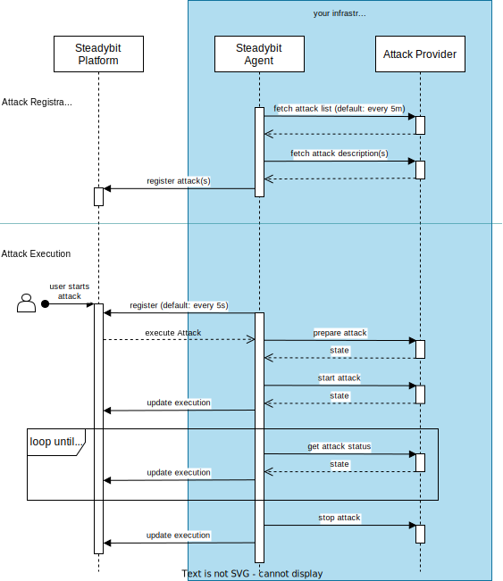

# Attack API

This document explains the attack API, control flow and the contracts behind it. It starts with a high-level overview and then explains every API in detail.

## Overview

Attacks are implemented with the help of AttackKit and the attack API through an implementation of an attack provider. Attack providers are HTTP servers implementing the attack API to describe which attacks are supported and how to execute these. The following diagram illustrates who is issuing calls and in what phases.



As can be seen above, the attack provider is called by the Steadybit agent in two phases:

- In the attack registration phase, Steadybit learns about the supported attacks. Once this phase is completed, attacks will be usable within Steadybit, e.g., within the experiment editor.
- The attack execution phase occurs whenever an attack is executed, e.g., as part of an experiment.

The following section explain the various API endpoints, their responsibilities and structures in more detail.

## Attack List

As the name implies, the attack list returns a list of supported attacks. Or, more specifically, HTTP endpoints that the agent should call to learn more about the attacks.

This endpoint needs to be [registered with Steadybit agents](./attack-registration.md).

### Example

```json
// Request: GET /attacks

// Response: 200
{
  "attacks": [
    {
      "method": "GET",
      "path": "/attacks/rollout-restart"
    }
  ]
}
```

### References

 - [TypeScript API](https://github.com/steadybit/attack-kit/tree/main/typescript-api): `IndexResponse`
 - [JSON Schema](https://github.com/steadybit/attack-kit/tree/main/json-schema): `attackListResponse`

## Attack Description

An attack description is required for each attack. The HTTP endpoint serving the description is discovered through the attack list endpoint.

Attack descriptions expose information about the presentation, configuration and behavior of attacks. For example:

 - What should the attack be called?
 - Which configuration options should be presented to end-users within the user interface?
 - Can the attack be stopped, or is this an instantaneous event, e.g., host reboots?

Attack description is a somewhat evolved topic, and you can find much more detailed information within our separate attack description document. 

### Example

```json
// Request: GET /attacks/rollout-restart

// Response: 200
{
  "id": "com.steadybit.example.attacks.kubernetes.rollout-restart",
  "name": "Kubernetes Rollout Restart Deployment",
  "description": "Execute a rollout restart for a Kubernetes deployment",
  "version": "1.0.0",
  "icon": "data:image/svg+xml;base64,PD94bWwgdmVyc2lvbj0iMS4wIiBlbmNvZGluZz0idXRmLTgiPz4NCjwhLS0gR2VuZXJhdG9yOiBBZG9iZSBJbGx1c3RyYXRvciAxNi4wLjQsIFNWRyBFeHBvcnQgUGx1Zy1JbiAuIFNWRyBWZXJzaW9uOiA2LjAwIEJ1aWxkIDApICAtLT4NCjwhRE9DVFlQRSBzdmcgUFVCTElDICItLy9XM0MvL0RURCBTVkcgMS4xLy9FTiIgImh0dHA6Ly93d3cudzMub3JnL0dyYXBoaWNzL1NWRy8xLjEvRFREL3N2ZzExLmR0ZCI+DQo8c3ZnIHZlcnNpb249IjEuMSIgaWQ9IkxheWVyXzEiIHhtbG5zPSJodHRwOi8vd3d3LnczLm9yZy8yMDAwL3N2ZyIgeG1sbnM6eGxpbms9Imh0dHA6Ly93d3cudzMub3JnLzE5OTkveGxpbmsiIHg9IjBweCIgeT0iMHB4Ig0KCSB3aWR0aD0iNjEycHgiIGhlaWdodD0iNTAyLjE3NHB4IiB2aWV3Qm94PSIwIDY1LjMyNiA2MTIgNTAyLjE3NCIgZW5hYmxlLWJhY2tncm91bmQ9Im5ldyAwIDY1LjMyNiA2MTIgNTAyLjE3NCINCgkgeG1sOnNwYWNlPSJwcmVzZXJ2ZSI+DQo8ZWxsaXBzZSBmaWxsPSIjQzZDNkM2IiBjeD0iMjgzLjUiIGN5PSI0ODcuNSIgcng9IjI1OSIgcnk9IjgwIi8+DQo8cGF0aCBpZD0iYmlyZCIgZD0iTTIxMC4zMzMsNjUuMzMxQzEwNC4zNjcsNjYuMTA1LTEyLjM0OSwxNTAuNjM3LDEuMDU2LDI3Ni40NDljNC4zMDMsNDAuMzkzLDE4LjUzMyw2My43MDQsNTIuMTcxLDc5LjAzDQoJYzM2LjMwNywxNi41NDQsNTcuMDIyLDU0LjU1Niw1MC40MDYsMTEyLjk1NGMtOS45MzUsNC44OC0xNy40MDUsMTEuMDMxLTE5LjEzMiwyMC4wMTVjNy41MzEtMC4xNywxNC45NDMtMC4zMTIsMjIuNTksNC4zNDENCgljMjAuMzMzLDEyLjM3NSwzMS4yOTYsMjcuMzYzLDQyLjk3OSw1MS43MmMxLjcxNCwzLjU3Miw4LjE5MiwyLjg0OSw4LjMxMi0zLjA3OGMwLjE3LTguNDY3LTEuODU2LTE3LjQ1NC01LjIyNi0yNi45MzMNCgljLTIuOTU1LTguMzEzLDMuMDU5LTcuOTg1LDYuOTE3LTYuMTA2YzYuMzk5LDMuMTE1LDE2LjMzNCw5LjQzLDMwLjM5LDEzLjA5OGM1LjM5MiwxLjQwNyw1Ljk5NS0zLjg3Nyw1LjIyNC02Ljk5MQ0KCWMtMS44NjQtNy41MjItMTEuMDA5LTEwLjg2Mi0yNC41MTktMTkuMjI5Yy00LjgyLTIuOTg0LTAuOTI3LTkuNzM2LDUuMTY4LTguMzUxbDIwLjIzNCwyLjQxNWMzLjM1OSwwLjc2Myw0LjU1NS02LjExNCwwLjg4Mi03Ljg3NQ0KCWMtMTQuMTk4LTYuODA0LTI4Ljg5Ny0xMC4wOTgtNTMuODY0LTcuNzk5Yy0xMS42MTctMjkuMjY1LTI5LjgxMS02MS42MTctMTUuNjc0LTgxLjY4MWMxMi42MzktMTcuOTM4LDMxLjIxNi0yMC43NCwzOS4xNDcsNDMuNDg5DQoJYy01LjAwMiwzLjEwNy0xMS4yMTUsNS4wMzEtMTEuMzMyLDEzLjAyNGM3LjIwMS0yLjg0NSwxMS4yMDctMS4zOTksMTQuNzkxLDBjMTcuOTEyLDYuOTk4LDM1LjQ2MiwyMS44MjYsNTIuOTgyLDM3LjMwOQ0KCWMzLjczOSwzLjMwMyw4LjQxMy0xLjcxOCw2Ljk5MS02LjAzNGMtMi4xMzgtNi40OTQtOC4wNTMtMTAuNjU5LTE0Ljc5MS0yMC4wMTZjLTMuMjM5LTQuNDk1LDUuMDMtNy4wNDUsMTAuODg2LTYuODc2DQoJYzEzLjg0OSwwLjM5NiwyMi44ODYsOC4yNjgsMzUuMTc3LDExLjIxOGM0LjQ4MywxLjA3Niw5Ljc0MS0xLjk2NCw2LjkxNy02LjkxN2MtMy40NzItNi4wODUtMTMuMDE1LTkuMTI0LTE5LjE4LTEzLjQxMw0KCWMtNC4zNTctMy4wMjktMy4wMjUtNy4xMzIsMi42OTctNi42MDJjMy45MDUsMC4zNjEsOC40NzgsMi4yNzEsMTMuOTA4LDEuNzY3YzkuOTQ2LTAuOTI1LDcuNzE3LTcuMTY5LTAuODgzLTkuNTY2DQoJYy0xOS4wMzYtNS4zMDQtMzkuODkxLTYuMzExLTYxLjY2NS01LjIyNWMtNDMuODM3LTguMzU4LTMxLjU1NC04NC44ODcsMC05MC4zNjNjMjkuNTcxLTUuMTMyLDYyLjk2Ni0xMy4zMzksOTkuOTI4LTMyLjE1Ng0KCWMzMi42NjgtNS40MjksNjQuODM1LTEyLjQ0Niw5Mi45MzktMzMuODVjNDguMTA2LTE0LjQ2OSwxMTEuOTAzLDE2LjExMywyMDQuMjQxLDE0OS42OTVjMy45MjYsNS42ODEsMTUuODE5LDkuOTQsOS41MjQtNi4zNTENCgljLTE1Ljg5My00MS4xMjUtNjguMTc2LTkzLjMyOC05Mi4xMy0xMzIuMDg1Yy0yNC41ODEtMzkuNzc0LTE0LjM0LTYxLjI0My0zOS45NTctOTEuMjQ3DQoJYy0yMS4zMjYtMjQuOTc4LTQ3LjUwMi0yNS44MDMtNzcuMzM5LTE3LjM2NWMtMjMuNDYxLDYuNjM0LTM5LjIzNC03LjExNy01Mi45OC0zMS4yNzNDMzE4LjQyLDg3LjUyNSwyNjUuODM4LDY0LjkyNywyMTAuMzMzLDY1LjMzMQ0KCXogTTQ0NS43MzEsMjAzLjAxYzYuMTIsMCwxMS4xMTIsNC45MTksMTEuMTEyLDExLjAzOGMwLDYuMTE5LTQuOTk0LDExLjExMS0xMS4xMTIsMTEuMTExcy0xMS4wMzgtNC45OTQtMTEuMDM4LTExLjExMQ0KCUM0MzQuNjkzLDIwNy45MjksNDM5LjYxMywyMDMuMDEsNDQ1LjczMSwyMDMuMDF6Ii8+DQo8L3N2Zz4NCg==",
  "category": "resource",
  "target": "kubernetes-deployment",
  "timeControl": "ONE_SHOT",
  "parameters": [
    {
      "label": "Wait for rollout completion?",
      "name": "wait",
      "type": "boolean",
      "description": "",
      "required": false,
      "advanced": true,
      "order": 0,
      "defaultValue": "false"
    }
  ],
  "prepare": {
    "method": "POST",
    "path": "/attacks/rollout-restart/prepare"
  },
  "start": {
    "method": "POST",
    "path": "/attacks/rollout-restart/start"
  },
  "stop": {
    "method": "POST",
    "path": "/attacks/rollout-restart/stop"
  }
}
```

### References

 - [TypeScript API](https://github.com/steadybit/attack-kit/tree/main/typescript-api): `DescribeAttackResponse`
 - [JSON Schema](https://github.com/steadybit/attack-kit/tree/main/json-schema): `describeAttackResponse`

### Versioning

Attacks are versioned strictly, and Steadybit will ignore definition changes for the same version. Remember to update the version every time you update the attack description.

### Time Control

Time control informs Steadybit about behavioral aspects of the attack. At this moment, there are three options:

 - Instantaneous that cannot be undone, e.g., killing processes or shutting down servers: `"timeControl": "ONE_SHOT"`
 - Attacks spanning a configurable amount of time that are stoppable, e.g., causing CPU/memory stress, network configuration changes: `"timeControl": "BY_AGENT"`. Note that these attacks require a parameter named `duration` with type `duration`.
 - Attacks spanning an unknown amount of time, e.g., waiting for a service to roll over or for deployment to finish. This option is not yet supported.

## Attack Execution

Attack execution is divided into three steps:

 - preparation
 - start
 - stop

HTTP endpoints represent each step. Steadybit learns about these endpoints through the attack description documented in the previous sections. The following sub-sections explain the responsibilities of each of the endpoints in detail. 

### Preparation

The preparation (or short `prepare`) step receives the attack's configuration options (representing the parameters defined in the attack description) and a selected target. The HTTP endpoint must respond with an HTTP status code `200` and a JSON response body containing a state object.

The state object is later used in HTTP requests to the start and stop endpoints. So you will want to include all the execution relevant information within the state object, e.g., a subset of the target's attributes, the configuration options and the original state (in case you are going to do some system modification as part of the start step).

#### Example

```json
// Request: POST /attacks/rollout-restart/prepare
{
  "config": {
    "wait": true
  },
  "target": {
    "name": "demo-dev/steadybit-demo/gateway",
    "attributes": {
      "k8s.deployment": ["gateway"],
      "k8s.namespace": ["steadybit-demo"],
      "k8s.cluster-name": ["demo-dev"]
    }
  }
}

// Response: 200
{
  "state": {
    "Cluster": "demo-dev",
    "Namespace": "steadybit-demo",
    "Deployment": "gateway",
    "Wait": true
  }
}
```

#### References

 - [TypeScript API](https://github.com/steadybit/attack-kit/tree/main/typescript-api): `PrepareRequest`, `PrepareResponse`
 - [JSON Schema](https://github.com/steadybit/attack-kit/tree/main/json-schema): `prepareAttackRequest`, `prepareAttackResponse`

### Start

The actual attack happens within the start step, i.e., this is where you will typically modify the system, kill processes or reboot servers.

The start step receives the prepare step's state object. The HTTP endpoint must respond with an HTTP status code `200` on success or `500` on failure. A JSON response body containing a state object may be returned. This state object is later passed to the stop step.

#### Example

```json
// Request: POST /attacks/rollout-restart/start
{
  "state": {
    "Cluster": "demo-dev",
    "Namespace": "steadybit-demo",
    "Deployment": "gateway",
    "Wait": true
  }
}

// Response: 200
{
  "state": {
    "Cluster": "demo-dev",
    "Namespace": "steadybit-demo",
    "Deployment": "gateway",
    "Wait": true
  }
}
```

#### References

 - [TypeScript API](https://github.com/steadybit/attack-kit/tree/main/typescript-api): `StartRequest`, `StartResponse`
 - [JSON Schema](https://github.com/steadybit/attack-kit/tree/main/json-schema): `startAttackRequest`, `startAttackResponse`

### Stop

The stop step exists to revert system modifications, stop CPU/memory stress or any other attacks.

The stop step receives the prepare or start step's state object. The HTTP endpoint must respond with an HTTP status code `200` on success or `500` on failure.

#### Example

```json
// Request: POST /attacks/rollout-restart/stop
{
  "state": {
    "Cluster": "demo-dev",
    "Namespace": "steadybit-demo",
    "Deployment": "gateway",
    "Wait": true
  }
}

// Response: 200
```

#### References

 - [TypeScript API](https://github.com/steadybit/attack-kit/tree/main/typescript-api): `StopRequest`
 - [JSON Schema](https://github.com/steadybit/attack-kit/tree/main/json-schema): `stopAttackRequest`