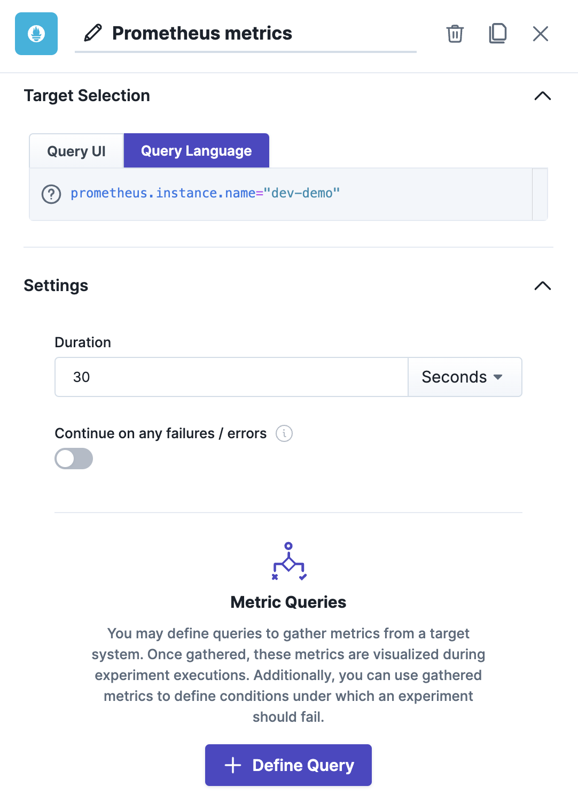
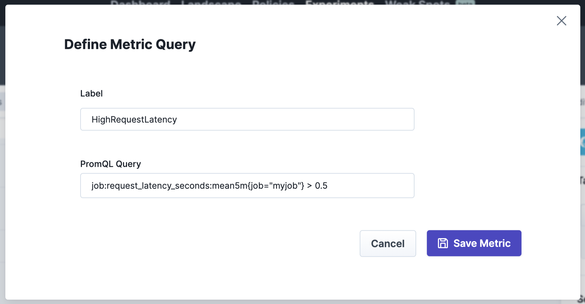
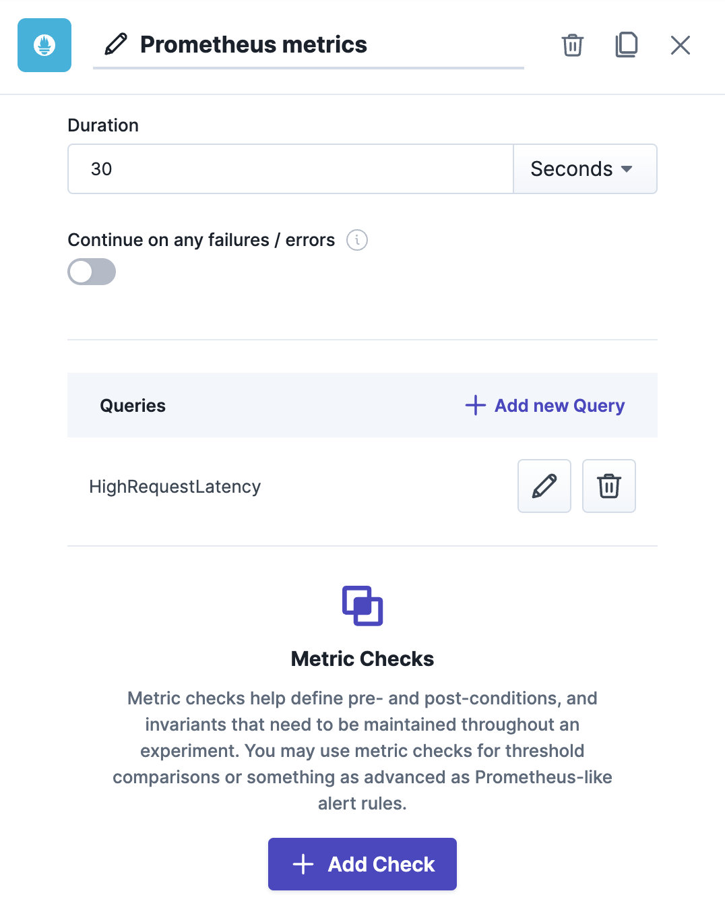
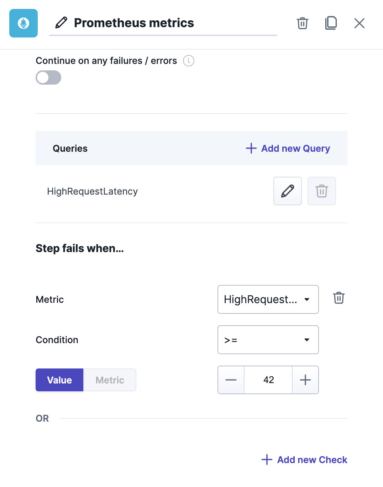
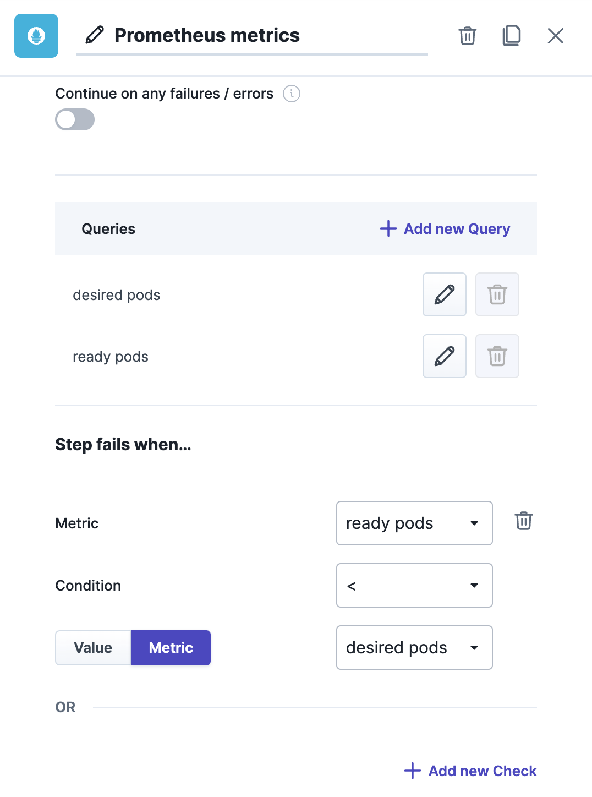
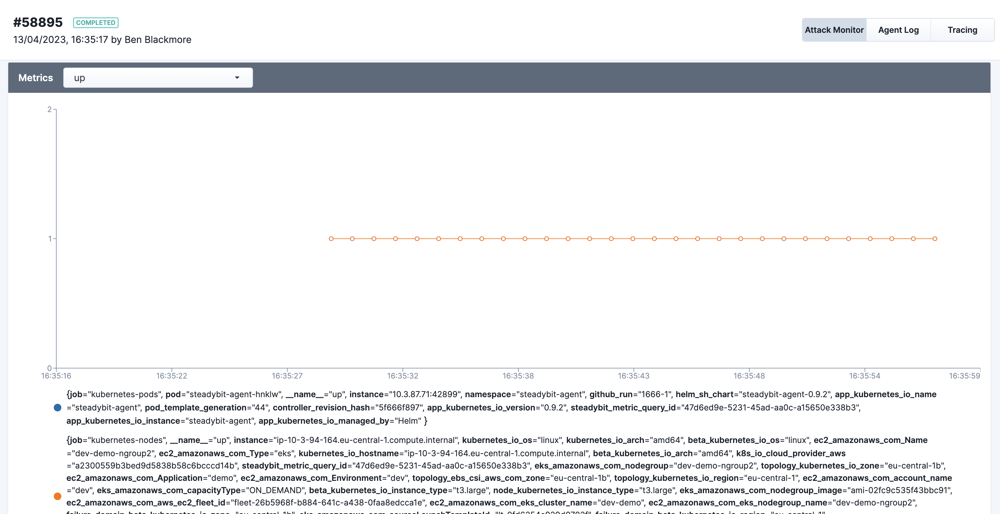

# How To Write An Extension That Queries Metrics

This how-to article will teach you how to write an extension using ActionKit that adds a new action that queries metrics from Prometheus. We will look closely at existing extensions to learn about semantic conventions, best practices, expected behavior and necessary boilerplate.

The article assumes you have authored an action before or read the [How To Write An Attack Extension article](./write-an-attack-extension.md). We are leveraging the Go programming language within the examples, but you can use every other language if you adhere to the expected API.

<!-- TOC -->
* [Overview from an End-User Perspective](#overview-from-an-end-user-perspective)
* [Overview from an Extension Developer Perspective](#overview-from-an-extension-developer-perspective)
* [Extending the Action Description](#extending-the-action-description)
* [Handling Query Requests](#handling-query-requests)
* [Conclusion](#conclusion)
<!-- TOC -->

## Overview from an End-User Perspective

Before we dive into the implementation, let us first understand what metric query support in ActionKit means for end-users. We will explain this using our Prometheus extension.

Any action with metric query support gains a new section within the action configuration sidebar. Through this section, users can define zero or more metric queries that will be sent to the extension for as long as this action runs within the experiment.

<a href="./img/prom-01-empty.png">

</a>

The image above shows that the Prometheus action gains a new configuration element for metric queries. It is important to note that the definition of metric queries is up to the extension. For Prometheus, a metric query is a PromQL query. Other systems may have other query systems, e.g., Elasticsearch has JSON objects for its request body search and the Lucene query language. ActionKit doesn't make any assumptions about the query parameters, as you will learn in this how-to.

<a href="./img/prom-02-define-query.png">

</a>

A popup asks for a label and the parameters required for the action's metric queries. As mentioned before, this is a PromQL query for Prometheus.

<a href="./img/prom-03-query-defined.png">

</a>

Once at least one metric query is defined, the user unlocks the ability to define metric checks. Metric checks can be used to fail experiments when certain conditions are met, e.g., metric values too high/low or when queries have results. The latter exists to support alerting patterns similar to how Prometheus alerts function.

<a href="./img/prom-04-check-defined.png">

</a>

This action will fail the experiment whenever the metric value for `HighRequestLatency` is greater than or equal to 42 – for any data series received via the metric query. Furthermore, users may also choose to compare two metrics against each other, as the following image will show.

<a href="./img/prom-05-cross-metric-query.png">

</a>

The image above shows a typical check within Kubernetes environments: Ensure all pods are ready. You can imagine how powerful and valuable this mechanism can be.

At last, the metric values are also available within the experiment execution view. Metric values are plotted over time, including their labels.

<a href="./img/prom-06-experiment-execution-view.png">

</a>

## Overview from an Extension Developer Perspective

The previous section has introduced a whole lot of capabilities! However, it is straightforward for extension developers to enable all of these. One of the objectives of the metric query support in ActionKit was to avoid code duplication across extensions while ensuring consistency and usability. As a consequence, actions wanting to support metric queries only have to do two things:

 1. Declare support for metric queries in the action description.
 2. Add an HTTP endpoint that receives the query configuration and responds with metrics.

The following two sections will guide you through both of these steps.

**Note:** Metric checks are a service of the Steadybit platform. Actions do not have to implement anything to support these.

## Extending the Action Description

The first step to support metric queries is to extend the action description. As you can see in the code snippet below, we need to do two things:

 1. Declare which HTTP endpoint call to query metrics. You can also control the frequency of these.
 2. Define what kind of parameters the users need to provide. These typically depend on the system you interact with within the HTTP endpoint mentioned above.

```go
// Source: https://github.com/steadybit/extension-prometheus/blob/66687c2ab745d22c0c2cb5b258f6c51b13d8e0a3/extmetric/extmetric.go#L60

import (
    "github.com/steadybit/action-kit/go/action_kit_api/v2"
    "github.com/steadybit/extension-kit/extutil"
)

action_kit_api.ActionDescription{
    // other fields removed for brevity
    Metrics: extutil.Ptr(action_kit_api.MetricsConfiguration{
        Query: extutil.Ptr(action_kit_api.MetricsQueryConfiguration{
            Endpoint: action_kit_api.MutatingEndpointReferenceWithCallInterval{
                Method:       action_kit_api.Post,
                Path:         "/prometheus/metrics/query",
                CallInterval: extutil.Ptr("1s"),
            },
            Parameters: []action_kit_api.ActionParameter{
                {
                    Name:     "query",
                    Label:    "PromQL Query",
                    Required: extutil.Ptr(true),
                    Type:     action_kit_api.String,
                },
            },
        }),
    }),
}
```


## Handling Query Requests

The HTTP endpoint's job is to translate the incoming QueryMetricsRequestBody HTTP request body into a QueryMetricsResult HTTP response body. Calling external systems and mapping their data types is common within the endpoint's implementation.

The following code snippet shows how to implement the endpoint for Prometheus. The most relevant parts for this how-to article are the last code blocks of the function. Within these blocks, the query received as part of the request is sent to Prometheus with the help of a Prometheus API client. Prometheus responds with metric values that we map into the expected ActionKit data types.

```go
// Source https://github.com/steadybit/extension-prometheus/blob/66687c2ab745d22c0c2cb5b258f6c51b13d8e0a3/extmetric/extmetric.go#L95
func Query(ctx context.Context, body []byte) (*action_kit_api.QueryMetricsResult, *extension_kit.ExtensionError) {
	var request action_kit_api.QueryMetricsRequestBody
	err := json.Unmarshal(body, &request)
	if err != nil {
		return nil, extension_kit.ToError("Failed to parse request body", err)
	}

	instance, err := extinstance.FindInstanceByName(request.Target.Name)
	if err != nil {
		return nil, extension_kit.ToError(fmt.Sprintf("Failed to find Prometheus instance named '%s'", request.Target.Name), err)
	}

	client, err := instance.GetApiClient()
	if err != nil {
		return nil, extension_kit.ToError("Failed to initialize Prometheus API client", err)
	}

	query := request.Config["query"]
	if query == nil {
		return nil, extension_kit.ToError("No PromQL query defined", nil)
	}

	result, _, err := client.Query(ctx, query.(string), request.Timestamp)
	if err != nil {
		return nil, extension_kit.ToError(fmt.Sprintf("Failed to execute Prometheus query against instance '%s' at timestamp %s with query '%s'",
			request.Target.Name,
			request.Timestamp,
			query),
			err))
	}

	vector, ok := result.(model.Vector)
	if !ok {
		return nil, extension_kit.ToError("PromQL query returned unexpect result. Only vectors are supported as query results", nil)
	}

	metrics := make([]action_kit_api.Metric, len(vector))
	for i, sample := range vector {
		metric := make(map[string]string, len(sample.Metric))
		for key, value := range sample.Metric {
			metric[string(key)] = string(value)
		}
		metrics[i] = action_kit_api.Metric{
			Timestamp: sample.Timestamp.Time(),
			Metric:    metric,
			Value:     float64(sample.Value),
		}
	}

	return extutil.Ptr(action_kit_api.QueryMetricsResult{
		Metrics: extutil.Ptr(metrics),
	}), nil
}
```
