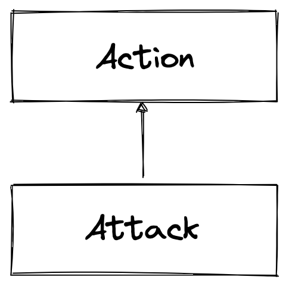

# How To Write An Attack Extension

This how-to article will teach you how to write an extension using ActionKit that adds new attack capabilities. We will look closely at existing extensions to learn about semantic conventions, best practices, expected behavior and necessary boilerplate.

The article assumes that you have read the [overview documentation](../action-api.md#overview) for the Action API and possibly skimmed over the expected API endpoints. We are leveraging the Go programming language within the examples, but you can use every other language as long as you adhere to the expected API.

<!-- TOC -->
  * [Necessary Boilerplate](#necessary-boilerplate)
  * [Action List](#action-list)
  * [Action Description](#action-description)
  * [Action Execution](#action-execution)
    * [Prepare](#prepare)
    * [Start](#start)
    * [Status](#status)
    * [Stop](#stop)
  * [Extension Registration](#extension-registration)
<!-- TOC -->

## Necessary Boilerplate

Every extension needs boilerplate code to start an HTTP server, initialize logging, and register HTTP handlers that comply with the expected API. The following excerpt shows how the go-kubectl example extension does this.

https://github.com/steadybit/action-kit/blob/128d8c05bdadb54e8b001391ead530e22d2d17a3/examples/go-kubectl/main.go#L14-L30

The excerpt above shows an extension leveraging our ExtensionKit, e.g., to register HTTP handlers or initialize the logging system. ExtensionKit makes authoring Steadybit extensions easier through utilities that help you comply with the expected behavior of extensions.

Note the HTTP endpoints' paths. You can choose these paths freely. The Steadybit agent only needs to know about the entry point into the extension. That would be {{origin}}/actions in this case.

## Action List

Let us start with the first API implementation: The list of supported actions. This endpoint is expected to provide a list of all actions that the extension supports. Note that an attack is a special kind of action.

<p align="center">
    
</p>

The attack list API endpoint's response body needs a JSON encoded list of HTTP endpoints that the Steadybit agent can call to learn more about each action.

https://github.com/steadybit/action-kit/blob/128d8c05bdadb54e8b001391ead530e22d2d17a3/examples/go-kubectl/handlers.go#L20-L29

All paths will be resolved relative to the URL used to register the extension at the agent. For example, if `https://extension/some-path` was used to register and this endpoint returns `/actions/rollout,` the agent will make the request to `https://extension/some-path/actions/rollout.` This allows extensions to run behind reverse proxies, rewriting the path. 


## Action Description

This is where the fun begins! The action description HTTP endpoint needs to expose information about the UI presentation of the attack, how end-users can configure it and which endpoints to call to prepare/start/stop the attack.

https://github.com/steadybit/action-kit/blob/128d8c05bdadb54e8b001391ead530e22d2d17a3/examples/go-kubectl/handlers.go#L31-L41

The excerpt above shows fundamental options for every action. You can learn more about these within the [action API documentation page](../action-api.md#action-description). Within this document, we are focussing on best practices specific to attacks.

- `kind`: Must be set to `attack`. This option controls the visual appearance, grouping and labeling within the Steadybit user interface.
- `targetType`: Attacks typically operate on a target. So you almost certainly want to specify a target type in here. You can learn about available target types through the Steadybit user interface via `Settings -> Extensions -> Target Types`.

https://github.com/steadybit/action-kit/blob/128d8c05bdadb54e8b001391ead530e22d2d17a3/examples/go-kubectl/handlers.go#L42-L50

There are no special parameter contracts for attacks. So within this area, you will define them just like any other action. Also, refer to our [parameter types documentation](../parameter-types.md) to learn more about the supported parameter types.

https://github.com/steadybit/action-kit/blob/128d8c05bdadb54e8b001391ead530e22d2d17a3/examples/go-kubectl/handlers.go#L51-L66

The last part of the action description is the list of endpoints to call when preparing, starting, checking and stopping the attack. The following sections will explain each endpoint's responsibility in more detail. For now, understand that you can define arbitrary HTTP endpoint paths.

## Action Execution

We assume you have read the more general action API documentation on the [action execution phases](../action-api.md#action-execution). If you haven't done so, now would be a good time to read these sections, as we won't repeat this content.

Actions only need to define prepare and start endpoints. The status and stop endpoints are optional. Let's look into the detail for each of those endpoints for attack use cases.

Note that all endpoints are supposed to respond in a maximum of 15 seconds. You can initiate long-running processes within the endpoints, but you should not synchronously wait for them to complete. For example, you should not trigger a redeployment within an attack and wait synchronously for it to come back up. You can use the status endpoint to implement a polling approach if you need to watch the status.

### Prepare
In addition to what the action API docs mention, attacks will typically want to prepare the attack execution even further by generating IDs, creating entities in target systems and more. That was pretty abstract. Let us look into examples!

```go
	// Source: https://github.com/steadybit/extension-aws/blob/c3b268b28291024a8e4bed67fe765533367118d5/extec2/instance_attack_state.go#L94-L107
	instanceId := request.Target.Attributes["aws-ec2.instance.id"]
	if instanceId == nil || len(instanceId) == 0 {
		return nil, extension_kit.ToError("Target is missing the 'aws-ec2.instance.id' tag.", nil)
	}

	action := request.Config["action"]
	if action == nil {
		return nil, extension_kit.ToError("Missing attack action parameter.", nil)
	}

	return extutil.Ptr(InstanceStateChangeState{
		InstanceId: instanceId[0],
		Action:     action.(string),
	}), nil
```

The most fundamental preparation activity is the extraction of attack parameters and target attributes into the action state. This extraction is necessary because start, status and stop only receive the action state. It also helps to keep the other endpoints' implementations more straightforward. Within the excerpt above from the AWS EC2 instance state change attack, we extract the `aws-ec2.instance.id` target attribute and the `action` parameter for later use.

```go
	// Source: https://github.com/steadybit/extension-kong/blob/2c2dfbbd98b69c12e033356ae10c95fc38c573e4/services/request_termination_attack.go#L172-L181
	plugin, err := instance.CreatePlugin(&kong.Plugin{
		Name:    utils.String("request-termination"),
		Enabled: utils.Bool(false),
		Tags: utils.Strings([]string{
			"created-by=steadybit",
		}),
		Service:  service,
		Consumer: consumer,
		Config:   config,
	})
```

Some attacks go even further, as the excerpt above shows. The Kong request termination attack already inserts a piece of configuration into the attacked system. However, note that the configuration is marked as *disabled*. The attack will only switch the configuration from disabled to enabled within the start endpoint. Such patterns can be applied where possible for comprehensive preparation incorporating, among others, a validation that system modification is possible, i.e., that the attack extension is allowed to modify the system state.

### Start

This is where the magic happens! Although quite often, this magic is just glue code. Within the start endpoint, you can finally start to break stuff. Execute shell scripts, trigger downstream HTTP calls, use API clients and whatever else you need to realize the attack. Again, let us look at some open-source attack implementations to see some patterns.

https://github.com/steadybit/action-kit/blob/cc141d7c81acdf4b15ef32c61659d4f1bd062445/examples/go-kubectl/handlers.go#L108-L119

The above is an excerpt from the Go kubectl example attack. It leverages the `kubectl` CLI to implement an attack. Using existing CLI tools is a fairly common pattern that makes it easy to realize an attack quickly.

Next, we have an excerpt from the AWS EC2 instance state change attack. This attack uses the AWS SDK to trigger system state changes.

```go
	// Source: https://github.com/steadybit/extension-aws/blob/c3b268b28291024a8e4bed67fe765533367118d5/extec2/instance_attack_state.go#L159-L162
	in := ec2.TerminateInstancesInput{
		InstanceIds: instanceIds,
	}
	_, err = client.TerminateInstances(ctx, &in)
```

Like the above, the Kong request termination attack leverages the Kong API client to the configuration of a plugin created through the prepare endpoint.

```go
	// Source: https://github.com/steadybit/extension-kong/blob/2c2dfbbd98b69c12e033356ae10c95fc38c573e4/services/request_termination_attack.go#L230-L233
	_, err := instance.UpdatePlugin(&kong.Plugin{
		ID:      &pluginId,
		Enabled: utils.Bool(true),
	})
```

### Status

The status endpoint is typically used with attacks that leverage an `internal` time control to implement a polling "are you done yet?"-check. Remember how each endpoint needs to respond within 15 seconds? Operations taking longer than these 15 seconds benefit from the status endpoint. Like before, let us look at an example!

https://github.com/steadybit/action-kit/blob/128d8c05bdadb54e8b001391ead530e22d2d17a3/examples/go-kubectl/handlers.go#L136-L160

The excerpt above shows code from the Go kubectl example attack. This attack supports the execution of `kubectl rollout restart...`, i.e., a simulated rollout of a Kubernetes deployment. The attack supports two modes:

1. Just triggering the simulated rollout.
2. Triggering and waiting for completion of the simulated rollout.

For the first mode, the status endpoint is not necessary. However, for mode two, the status endpoint is necessary. Rollouts routinely take longer than 15 seconds, so waiting must happen outside the start endpoint.

Notice how the attack first checks whether its parameters instructed it to wait for rollout completion. If waiting isn't configured, it will immediately respond with `completed: true` in the JSON response body. When configured to wait, it will check the rollout status via the `kubectl` CLI and then respond according to the CLI's output.

The status endpoint is called until it responds with `completed: true` or until the experiment is canceled.

### Stop

Stop is the final endpoint. It is optional. When it is defined, the implementation is expected to revert all system modifications. Meaning: There should not be any evidence that an attack was executed. Not every attack needs a stop implementation. For example, one cannot stop the reboot of an AWS EC2 instance.

```go
	// Source: https://github.com/steadybit/extension-kong/blob/2c2dfbbd98b69c12e033356ae10c95fc38c573e4/services/request_termination_attack.go#L267-L270
	err := instance.DeletePlugin(&pluginId)
	if err != nil {
		return attack_kit_api.Ptr(utils.ToError(fmt.Sprintf("Failed to delete plugin within Kong for plugin ID '%s'", pluginId), err))
	}
```

The above shows what the Kong request termination attack is doing to revert system modifications. The attack created a configuration within the Kong API gateway within the prepare method. As part of the stop endpoint, the attack deletes the configuration.

## Extension Registration

Congratulations, the extension is now completed! This leaves only one last step: Announcing the extension to the Steadybit agents. Read more on this topic within our separate [action registration document](../action-registration.md).
