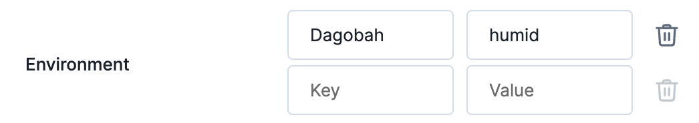

# Parameter Types

Actions support parameters for configuration purposes. For example, you may want to use a parameter of type `duration` to configure how long an action is
supposed to take. This document explains what the supported parameter types are and how they work.

Supported parameter types:

  * [`boolean`](#boolean)
  * [`duration`](#duration)
  * [`integer`](#integer)
  * [`percentage`](#percentage)
  * [`string`](#string)
  * [`string_array`](#string_array)
  * [`password`](#password)
  * [`file`](#file)
  * [`key_value`](#key_value)

## `boolean`

Either `true` or `false` values. With optional support for `null` when `required=false` and no `defaultValue` is defined.


### Example

#### Parameter Definition

```json
{
  "name": "activateOrder66",
  "label": "Eradicate Jedi Order?",
  "type": "boolean",
  "defaultValue": "false"
}
```

#### Configuration Value Received in `prepare` Call of Actions

##### With a Value
```json
{
  "activateOrder66": true
}
```

##### Without a Value

```json
{
  "activateOrder66": null
}
```

## `duration`

A time duration. Renders appropriate UI controls that facilitate time inputs—exposed as `number`s representing milliseconds to extensions.

**Note:** Make sure to name the field `duration` should you desire that the experiment editor uses a duration field to visualize the expected length of an action.


### Example

#### Parameter Definition

```json
{
  "name": "jarJarBinksSongDuration",
  "label": "How long do you want to be bothered by Jar Jar Binks?",
  "type": "duration",
  "defaultValue": "0s"
}
```

#### Configuration Value Received in `prepare` Call of Actions

##### With a Value
```json
{
  "jarJarBinksSongDuration": 5000 // milliseconds
}
```

##### Without a Value

```json
{
  "jarJarBinksSongDuration": null
}
```

## `integer`

Any integer number.


### Example

#### Parameter Definition

```json
{
  "name": "starWarsEpisode",
  "label": "What is your favorite Star Wars episode?",
  "type": "integer",
  "defaultValue": "4"
}
```

#### Configuration Value Received in `prepare` Call of Actions

##### With a Value
```json
{
  "starWarsEpisode": 5
}
```

##### Without a Value

```json
{
  "starWarsEpisode": null
}
```

## `percentage`

`percentage` is a variation of the `integer` parameter that renders more appropriate user interface controls. A value of 0% is represented as the number `0`. 100% is represented as the number `100`.


### Example

#### Parameter Definition

```json
{
  "name": "deathStarEnergyLevel",
  "label": "How much should the Death Star be charged?",
  "type": "percentage",
  "defaultValue": "69"
}
```

#### Configuration Value Received in `prepare` Call of Actions

##### With a Value
```json
{
  "deathStarEnergyLevel": 69
}
```

##### Without a Value

```json
{
  "deathStarEnergyLevel": null
}
```

## `string`

Strings are the most fundamental parameter type. They represent arbitrary character sequences just like you would expect.

**Note:** It is the responsibility of an extension to decide what to do when receiving an empty string.


### Example

#### Parameter Definition

```json
{
  "name": "fullName",
  "label": "Full Name",
  "type": "string",
  "defaultValue": "Jane Doe"
}
```

#### Configuration Value Received in `prepare` Call of Actions

##### With a Value
```json
{
  "fullName": "Admiral Ackbar"
}
```

##### With an Empty String

```json
{
  "fullName": ""
}
```

##### Without a Value

```json
{
  "fullName": "Jane Doe"
}
```

## `string_array`

You can use the `string_array` type for multiple textual inputs. 


You may define options that users can select. Options are either explicit, i.e., fixed and known in advance (identifiable by the `label` and `value` properties). Or options based on target attributes' values (identifiable by the `attribute` property).

### Example

#### Parameter Definition

```json
{
  "name": "lightsaberCombatForm",
  "label": "Lightsaber Combat Form",
  "type": "string_array",
  "defaultValue": "[\"shii_cho\", \"ataru\"]",
  "options": [
    {
      "label": "Shii-Cho",
      "value": "shii_cho"
    },
    {
      "label": "Makashi",
      "value": "makashi"
    },
    {
      "label": "Soresu",
      "value": "soresu"
    },
    {
      "label": "Ataru",
      "value": "ataru"
    },
    
    // or automatically created options from all known values for this target attribute key 
    {
      "attribute": "combat.form"
    }
  ]
}
```

#### Configuration Value Received in `prepare` Call of Actions

##### With a Value
```json
{
  "lightsaberCombatForm": ["soresu"]
}
```

##### Without a Selected Input

```json
{
  "lightsaberCombatForm": []
}
```


##### Without any Input

```json
{
  "lightsaberCombatForm": null
}
```

## `password`

The `password` parameter behaves like the `string` parameter type, except for the visual presentation in the Steadybit user interface.


## `file`

Files can be uploaded and passed to actions through a parameter of the `file` type. Uploaded files are delivered to actions in base64 encoding. Through the optional `acceptedFileTypes` option you can restrict [what kind of files](https://developer.mozilla.org/en-US/docs/Web/HTML/Element/input/file#unique_file_type_specifiers) may be selected by users.


### Example

#### Parameter Definition

```json
{
  "name": "schematics",
  "label": "Space Ship Schematics",
  "type": "file",
  "acceptedFileTypes": [".svg", ".dwg"]
}
```

#### Configuration Value Received in `prepare` Call of Actions

##### With a Value
```json
{
  "schematics": "WW91IGFyZSBxdWl0ZSBjdXJpb3VzISBIZXJlLCBoYXZlIGEgY29va2llISBBbHNvLCBjaGVjayBvdXQgaHR0cHM6Ly9zdGFyd2Fycy5mYW5kb20uY29tL3dpa2kvRGVhdGhfU3Rhcl9wbGFucyE="
}
```


##### Without a Value

```json
{
  "schematics": null
}
```

## `key_value`

For key/value pairs, e.g., tags, labels and environment variables, we support a `key_value` parameter type.



### Example

#### Parameter Definition

```json
{
  "name": "env",
  "label": "Environment",
  "type": "key_value",
}
```

#### Configuration Value Received in `prepare` Call of Actions

##### With a Value
```json
{
  "env": [
    {
      "key": "Dagobah",
      "value": "humid"
    }
  ]
}
```


##### Without a Value

```json
{
  "env": []
}