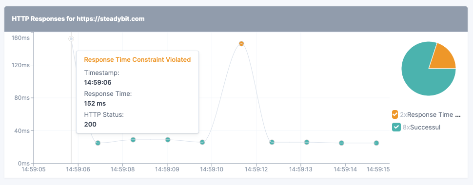

# Run View Widgets

To enhance the user experience, ActionKit also supports the extension of the experiment run view with widgets. Supported widget types are pre-defined and controlled through the configuration of the ActionDescription and reported metrics.

Supported widgets types:

* [State Over Time](#state-over-time)
* [Line Chart](#line-chart)
* [Log Widget](#log-widget)
* [Markdown Widget](#markdown-widget)

All widgets require two components to function:

- Metrics or Logs containing the information. These are returned by the action during experiment execution by the various endpoints, e.g., the `status` endpoint.
- Static configuration describes how the widget should filter, aggregate, and label the metrics for user presentation. This configuration is part of the `ActionDescription` and is returned by the `describe` endpoint.

## State Over Time

This widget helps visualize how the state of a system or component evolved. For example, to show a Kubernetes pod's readiness state or the state of the monitoring system's alarms. The screenshot below depicts how the [Datadog extension](https://github.com/steadybit/extension-datadog) uses this widget type to visualize the state of [Datadog monitors](https://docs.datadoghq.com/monitors/) over time.


### Configuration

The widget configuration describes from which metric fields Steadybit should retrieve information. More specifically:

- `identity.from`: Maps to the name of a metric field containing a unique identifier per desired chart row within the UI.
- `label.from`: Maps to the name of a metric field containing a human-readable label per desired chart row within the UI.
- `state.from`: Maps to the name of a metric field containing the current state at any time. Supported values for this field are:
  - `danger` - 
  - `warn` - 
  - `success` - 
  - `info` - 
- `tooltip.from`: Maps to the name of a metric field containing the current tooltip at any time.
- `url.from`: Maps to the name of a metric field containing a URL. When available, it causes a chart segment to turn into a hyperlink.
- `value.hide`: Controls whether the metric values carry meaning and should be shown.

The following snippet is an example depicting the Datadog extension's configuration.

```json
{
  "widgets": [
    {
      "type":  "com.steadybit.widget.state_over_time",
      "title": "Datadog Monitor Status",
      "identity": {
        "from": "datadog.monitor.id"
      },
      "label": {
        "from": "datadog.monitor.name"
      },
      "state": {
        "from": "state"
      },
      "tooltip": {
        "from": "tooltip"
      },
      "url": {
        "from": "url"
      },
      "value": {
        "hide": true
      }
    }
  ]
}
```

### Metrics

You need to provide data points for this widget through metrics. You can define metrics through various ActionKit endpoints, e.g., the `status` endpoint. The following snippet is an example of a metric generated by the Datadog extension.

```json
{
  "metrics": [
    {
      "name": "datadog_monitor_status",
      "metric": {
        "datadog.monitor.id": "123456",
        "datadog.monitor.name": "No deployment replicas",
        "state": "danger",
        "tooltip": "Monitor status is: Alert",
        "url": "https://app.datadoghq.eu/monitors/8520915"
      },
      "timestamp": "2022-11-04T19:16:52+0100",
      "value": 0
    }
  ]
}
```

## Line Chart

This widget helps visualize value in a line chart. For example, to show response times of an HTTP Endpoint. The screenshot below shows how the [HTTP extension](https://github.com/steadybit/extension-http) uses this widget type.



### Configuration

The widget configuration describes from which metric fields Steadybit should retrieve information. More specifically:

- `Identity`
  - `Metric` & `From`: Which metrics should be considered to be part of the same line chart. The `identity.metric` is the name of the metric, `identity.from` is the name of the metric attribute which will form a line.
  - `Mode`: The mode of the identity. Supported values are:
    - `widget_per_value`: Each value returned by the attribute specified by `identity.from` will be a separate widget in the run view.
    - `select`: Each value returned by the attribute specified by `identity.from` can be selected in the header of a single widget in the run view.
- `Grouping`: Optional - can be used to group datapoints and color them. If not provided, all values will be shown in the same color.
  - `ShowSummary`: Controls whether a summary of the values should be shown in a pie-chart.
  - `Groups`: A list of groups that should be shown in the line chart. Each group has a title, color, and a matcher. The matcher specifies how to filter the values of the metric to be part of the group.
    - `Color`:
      - `danger` - 
      - `warn` - 
      - `success` - 
      - `info` - 
    - `Matcher`:'
      - `action_kit_api.LineChartWidgetGroupMatcherFallback`: All values that do not match any other group will be part of this group.
      - `action_kit_api.LineChartWidgetGroupMatcherNotEmpty`: All values with a non empty attribute specified by `key` will be part of this group.
      - `action_kit_api.LineChartWidgetGroupMatcherKeyEqualsValue`: `key` with a specific `value` will be part of this group.
- `Tooltip`: Optional - can be used to configure the tooltip of the line chart.
  - `MetricValueTitle`: The value of the metric specified by `identity` is always shown in the tooltip. `MetricValueTitle` specifies the title of the metric value.
  - `MetricValueUnit`: The unit of the value for the y-axis.
  - `AdditionalContent`: A list of additional content that should be shown in the tooltip. Each additional content has a title and a from attribute. Attribute which don't exist in the metric will be ignored.

The following snippet is an example of the widget definition in extension-http.

```go
return action_kit_api.ActionDescription{
...
    Widgets: extutil.Ptr([]action_kit_api.Widget{
        action_kit_api.LineChartWidget{
            Type:  action_kit_api.ComSteadybitWidgetLineChart,
            Title: "HTTP Responses",
            Identity: action_kit_api.LineChartWidgetIdentityConfig{
                MetricName: "response_time",
                From:       "url",
                Mode:       action_kit_api.ComSteadybitWidgetLineChartIdentityModeWidgetPerValue,
            },
            Grouping: extutil.Ptr(action_kit_api.LineChartWidgetGroupingConfig{
                ShowSummary: extutil.Ptr(true),
                Groups: []action_kit_api.LineChartWidgetGroup{
                    {
                        Title: "Successul",
                        Color: "success",
                        Matcher: action_kit_api.LineChartWidgetGroupMatcherFallback{
                            Type: action_kit_api.ComSteadybitWidgetLineChartGroupMatcherFallback,
                        },
                    },
                    {
                        Title: "Failure",
                        Color: "danger",
                        Matcher: action_kit_api.LineChartWidgetGroupMatcherNotEmpty{
                            Type: action_kit_api.ComSteadybitWidgetLineChartGroupMatcherNotEmpty,
                            Key:  "error",
                        },
                    },
                    {
                        Title: "Unexpected Status",
                        Color: "warn",
                        Matcher: action_kit_api.LineChartWidgetGroupMatcherKeyEqualsValue{
                            Type:  action_kit_api.ComSteadybitWidgetLineChartGroupMatcherKeyEqualsValue,
                            Key:   "expected_http_status",
                            Value: "false",
                        },
                    },
                    ...
                },
            }),
            Tooltip: extutil.Ptr(action_kit_api.LineChartWidgetTooltipConfig{
                MetricValueTitle: extutil.Ptr("Response Time"),
                MetricValueUnit:  extutil.Ptr("ms"),
                AdditionalContent: []action_kit_api.LineChartWidgetTooltipContent{
                    {
                        From:  "error",
                        Title: "Error",
                    },
                    {
                        From:  "http_status",
                        Title: "HTTP Status",
                    },
                },
            }),
        },
    })
```

### Metrics

You need to provide data points for this widget through metrics. You can define metrics through various ActionKit endpoints, e.g., the `status` endpoint. The following snippet is an example of a metric generated by the HTTP extension.

```json
{
  "metrics": [
    {
      "name": "response_time",
      "metric": {
        "url": "https://www.steadybit.com",
        "http_status": "200",
        "response_time_constraints_fulfilled": "false"
      },
      "timestamp": "2024-10-04T19:16:52+0100",
      "value": 156
    }
  ]
}
```

## Log Widget

This widget helps visualize the output of a log stream. For example, to show the output of a Kubernetes events. The screenshot below depicts how the [Kubernetes extension](https://github.com/steadybit/extension-kubernetes) uses this widget type to visualize the output of a Kubernetes events.


### Configuration

The widget configuration describes from which events fields Steadybit should retrieve information. More specifically:

- `Type` which is set to "com.steadybit.widget.log" / ComSteadybitWidgetLog constant.
- `Title` of the widget, e.g. "Kubernetes Events"
- `LogType` specifies the type of messages, that should be displayed in the widget, e.g. "KUBERNETES_EVENTS". Must be the same as the one used in the action messages send (Message.Type).

The following snippet is an example depicting the Kubernetes extension's configuration.

```go
return action_kit_api.ActionDescription{
    ...
    Widgets: extutil.Ptr([]action_kit_api.Widget{
        action_kit_api.LogWidget{
            Type:    action_kit_api.ComSteadybitWidgetLog,
            Title:   "Kubernetes Events",
            LogType: "KUBERNETES_EVENTS",
        },
    }),
}
```

Each log that is displayed is a representation of a Message. Messages can be send to the platform during status and stop phase of the action. The message must in include the correct type as described above. The message can also include a payload of fields which is displayed in the log widget as tooltip.
e.g.
```go
action_kit_api.Message{
    Message:   "Pulling image 'steadybit/bestseller-fashion'",
    Type:      extutil.Ptr("KUBERNETES_EVENTS"),
    Level:     action_kit_api.Info,
    Timestamp: extutil.Ptr(event.LastTimestamp.Time),
    Fields: extutil.Ptr(action_kit_api.MessageFields{
        "reason":       event.Reason,
        "cluster-name": clusterName,
        "namespace":    event.Namespace,
        "object":       strings.ToLower(event.InvolvedObject.Kind) + "/" + event.InvolvedObject.Name,
    }),
}
```  


## Markdown Widget

With that Widget, you are able to render custom markdown content in the run view. This can be used to provide additional information or links to external resources. The screenshot shows the widget in action.


### Configuration

- `Type` which is set to "com.steadybit.widget.markdown" / ComSteadybitWidgetMarkdown constant.
- `MessageType` specifies the type of messages, that should be displayed in the widget, e.g. "MY_CUSTOM_ACTION_RESULTS". Must be the same as the one used in the action messages send (Message.Type).
- `Title` of the widget, e.g. "Example Markdown Content"
- `Append` specifies if the content should be appended to the existing content or replace it.
  - If set to `true`, the widget will append the content to the existing content of previous endpoint calls. For example, you can return some headings in the `start` call, append some progress information in the `status` calls and add a summary in the `stop` call. 
  - If set to `false`, the widget will only show the last submitted content batch, grouped by `timestamp`. Older content will be displayed, when clicking on the timeline in the run view. To improve the performance, you should only return messages if the content has changed compared to the previous batch.

Example:

```go
return action_kit_api.ActionDescription{
    ...
    Widgets: extutil.Ptr([]action_kit_api.Widget{
        action_kit_api.MarkdownWidget{
            Type:    action_kit_api.ComSteadybitWidgetMarkdown,
            Title:   "Example Markdown Content",
            MessageType: "MY_CUSTOM_ACTION_RESULTS",
            Append:  true,
        },
    }),
}
```

The markdown content will be submitted to the platform in the representation of a `action_kit_api.Message`. Messages can be returned in all endpoints of the action. The message must in include the correct type as described above.
e.g.
```go
action_kit_api.Message{
    Message:   "# I will start now",
    Type:      extutil.Ptr("MY_CUSTOM_ACTION_RESULTS"),
    Timestamp: extutil.Ptr(time.now()),
}
```  
